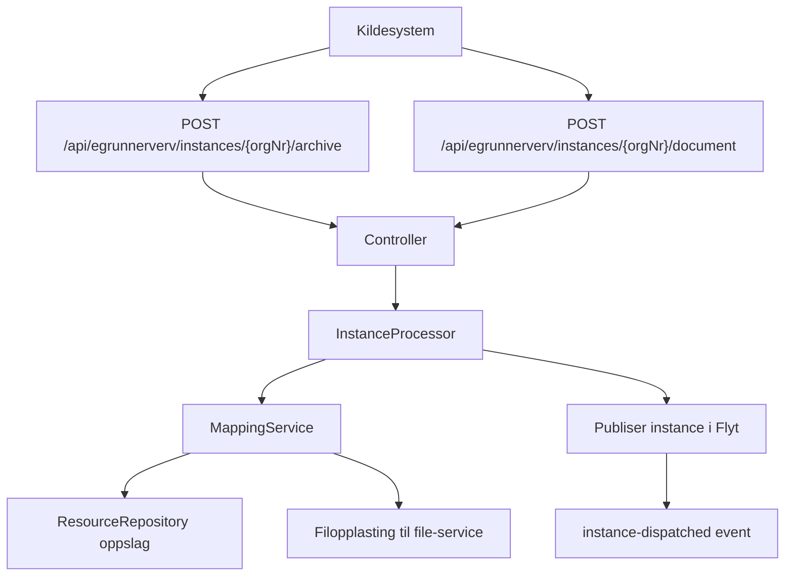
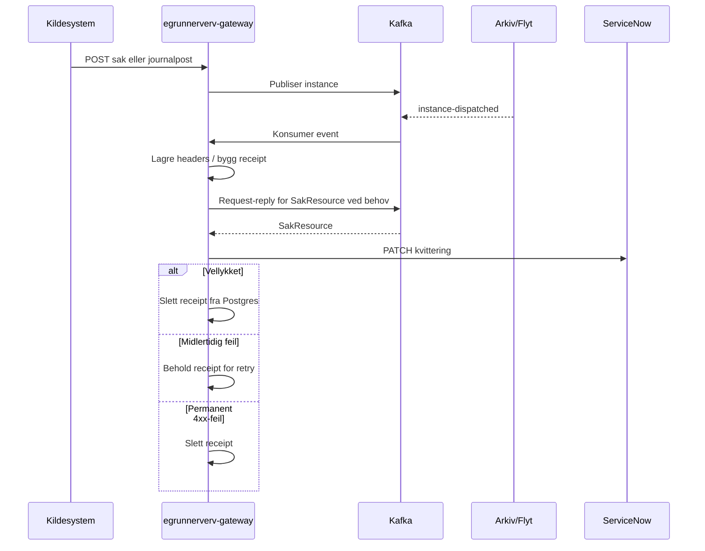

# FINT Flyt egrunnerverv gateway

Kotlin-basert Spring Boot-tjeneste for mottak av eGrunnerverv-instanser i Flyt. Tjenesten eksponerer et eksternt HTTP-API, mapper innkommende payloads til Flyt web instance-objekter, laster opp dokumenter til fil-tjenesten og håndterer dispatch av kvitteringer tilbake til kildesystemet når instanser er ferdig behandlet.

## Høydepunkter

- Spring Boot 3.5.x
- Spring MVC (`spring-boot-starter-web`)
- Kotlin 2.3.10
- Java 25
- `flyt-web-instance-gateway` for mottak og videreformidling av instanser
- `flyt-web-resource-server` for sikring av eksterne API-er
- Global feilbehandling med `ProblemDetail`
- Kafka-basert dispatchflyt for kvitteringer
- Postgres + Flyway for persistens av dispatch-kø
- `ktlint` og `.editorconfig`

## Hva tjenesten gjør

- Mottar `sak`- og `journalpost`-payloads over HTTP.
- Validerer payloads og mapper dem til Flyt sine `InstanceObject`-strukturer.
- Slår opp arkivressurser for saksansvarlig og saksbehandler når disse kontrollene er aktivert.
- Laster opp hoveddokument og vedlegg til fil-tjenesten.
- Publiserer instanser videre i Flyt-økosystemet via `flyt-web-instance-gateway`.
- Lytter på `instance-dispatched`-events og bygger kvitteringspayloads tilbake til ServiceNow.

## Arkitektur

| Komponent                                       | Ansvar                                                             |
|-------------------------------------------------|--------------------------------------------------------------------|
| `EgrunnervervInstanceController`                | Eksterne endepunkter for mottak av `sak` og `journalpost`.         |
| `EgrunnervervSakInstanceMappingService`         | Mapper `sak` til Flyt `InstanceObject`.                            |
| `EgrunnervervJournalpostInstanceMappingService` | Mapper `journalpost`, inkludert filopplasting.                     |
| `ResourceRepository`                            | Cachet oppslag fra Kafka-synkede FINT-ressurser.                   |
| `DispatchService`                               | Håndterer lagring, konvertering og retry av dispatch-kvitteringer. |
| `CaseRequestService`                            | Request-reply mot Kafka for å hente `SakResource`.                 |
| `RestClientRequestService`                      | Sender kvitteringer til ServiceNow.                                |
| `GlobalExceptionHandler`                        | Standardiserer feilresponser med `ProblemDetail`.                  |

## Flyt

### Mottak og videre behandling



### Dispatch av kvittering



## HTTP API

Base path:

```text
/api/egrunnerverv/instances/{orgNr}
```

API-et er beskyttet av `flyt-web-resource-server`. Autoriserte source application IDs er satt i [`src/main/resources/application-flyt-web-resource-server.yaml`](src/main/resources/application-flyt-web-resource-server.yaml).

### POST `/archive`

Oppretter en `sak`-instans.

Eksempel:

```json
{
  "sys_id": "abc123",
  "table": "x_nvas_grunnerverv_grunnerverv",
  "knr": "0301",
  "gnr": "1",
  "bnr": "2",
  "fnr": "0",
  "snr": "0",
  "takstnummer": "100",
  "tittel": "Erverv av grunn",
  "saksansvarligEpost": "saksansvarlig@vlfk.no",
  "eierforholdsnavn": "Privat",
  "eierforholdskode": "P",
  "prosjektnr": "12345",
  "prosjektnavn": "Nytt prosjekt",
  "kommunenavn": "BERGEN",
  "adresse": "Eksempelveien 1",
  "saksparter": [
    {
      "navn": "Ola Nordmann",
      "organisasjonsnummer": "999999999",
      "epost": "ola@example.no",
      "telefon": "12345678",
      "postadresse": "Eksempelveien 2",
      "postnummer": "5000",
      "poststed": "Bergen"
    }
  ],
  "klasseringer": [
    {
      "ordningsprinsipp": "GNR",
      "ordningsverdi": "1/2",
      "beskrivelse": "Eiendom",
      "sortering": "1",
      "untattOffentlighet": "false"
    }
  ]
}
```

Respons:

- `202 Accepted` ved vellykket mottak
- `400 Bad Request` ved ugyldig request
- `422 Unprocessable Entity` ved domenefeil fra instance-prosessering

### POST `/document?id={saksnummer}`

Oppretter en `journalpost`-instans. Requesten må inneholde ett hoveddokument (`hoveddokument=true`).

Eksempel:

```json
{
  "sys_id": "abc123",
  "table": "x_nvas_grunnerverv_dokumenter",
  "tittel": "Tilbudsbrev",
  "dokumentNavn": "Tilbudsbrev.pdf",
  "dokumentDato": "2026-04-08",
  "forsendelsesmaate": "Digital",
  "kommunenavn": "BERGEN",
  "knr": "0301",
  "gnr": "1",
  "bnr": "2",
  "fnr": "0",
  "snr": "0",
  "eierforhold": "Privat",
  "id": "journalpost-1",
  "maltittel": "Standardmal",
  "prosjektnavn": "Nytt prosjekt",
  "saksbehandler": "saksbehandler@vlfk.no",
  "mottakere": [
    {
      "navn": "Ola Nordmann",
      "organisasjonsnummer": "999999999",
      "epost": "ola@example.no",
      "telefon": "12345678",
      "postadresse": "Eksempelveien 2",
      "postnummer": "5000",
      "poststed": "Bergen"
    }
  ],
  "dokumenter": [
    {
      "tittel": "Tilbudsbrev",
      "hoveddokument": true,
      "filnavn": "tilbudsbrev.pdf",
      "dokumentBase64": "JVBERi0xLjcKJYGBgY..."
    },
    {
      "tittel": "Vedlegg",
      "hoveddokument": false,
      "filnavn": "vedlegg.pdf",
      "dokumentBase64": "JVBERi0xLjcKJYGBgY..."
    }
  ]
}
```

Respons:

- `202 Accepted` ved vellykket mottak
- `400 Bad Request` ved ugyldig request
- `422 Unprocessable Entity` ved domenefeil fra instance-prosessering

## Feilhåndtering

Tjenesten returnerer `ProblemDetail` (`application/problem+json`) fra `GlobalExceptionHandler`.

Typiske statuser:

- `400 Bad Request`: valideringsfeil, ugyldig JSON eller manglende query-parametre
- `405 Method Not Allowed`: ikke støttet HTTP-metode
- `422 Unprocessable Entity`: domenefeil fra instance-gateway, for eksempel manglende integrasjon eller avvist instance
- `500 Internal Server Error`: uventede serverfeil

Interne detaljer eksponeres ikke i generiske `500`-responser, men alle feil logges.

## Persistens

Flyway-migrasjoner ligger i [`src/main/resources/db/migration`](src/main/resources/db/migration).

Opprettede tabeller:

- `instance_headers_entity`: midlertidig lagring av dispatch-headere
- `instance_receipt_dispatch_entity`: retry-kø for kvitteringer som ikke er dispatch-et ennå

## Konfigurasjon

Viktige konfigurasjonsfiler:

- [`src/main/resources/application.yaml`](src/main/resources/application.yaml)
- [`src/main/resources/application-flyt-web-resource-server.yaml`](src/main/resources/application-flyt-web-resource-server.yaml)
- [`src/main/resources/application-flyt-file-web-client.yaml`](src/main/resources/application-flyt-file-web-client.yaml)
- [`src/main/resources/application-flyt-service-now-web-client.yaml`](src/main/resources/application-flyt-service-now-web-client.yaml)
- [`src/main/resources/application-flyt-postgres.yaml`](src/main/resources/application-flyt-postgres.yaml)
- [`src/main/resources/application-local-staging.yaml`](src/main/resources/application-local-staging.yaml)

Vanlige properties og secrets:

| Property                                          | Beskrivelse                                                 |
|---------------------------------------------------|-------------------------------------------------------------|
| `fint.application-id`                             | App-id for tjenesten.                                       |
| `fint.org-id`                                     | Org-id brukt blant annet i Slack-meldinger og lokal profil. |
| `fint.database.url`                               | JDBC URL til Postgres.                                      |
| `fint.database.username`                          | DB-bruker.                                                  |
| `fint.database.password`                          | DB-passord.                                                 |
| `fint.sso.client-id`                              | OAuth2 client id for fil-tjenesten.                         |
| `fint.sso.client-secret`                          | OAuth2 client secret for fil-tjenesten.                     |
| `novari.flyt.file-service-url`                    | Base URL til fil-tjenesten.                                 |
| `novari.flyt.egrunnerverv.dispatch.base-url`      | Base URL til ServiceNow-tabell-API.                         |
| `novari.flyt.egrunnerverv.dispatch.token-uri`     | Token endpoint for ServiceNow OAuth2.                       |
| `novari.flyt.egrunnerverv.dispatch.client-id`     | OAuth2 client id for ServiceNow.                            |
| `novari.flyt.egrunnerverv.dispatch.client-secret` | OAuth2 client secret for ServiceNow.                        |
| `novari.flyt.egrunnerverv.dispatch.username`      | ServiceNow brukernavn for password grant.                   |
| `novari.flyt.egrunnerverv.dispatch.password`      | ServiceNow passord for password grant.                      |
| `slack.webhook.url`                               | Webhook for Slack-varsling ved manglende arkivressurs.      |

## Profiler

Default profiler inkludert via `application.yaml`:

- `flyt-kafka`
- `flyt-logging`
- `flyt-postgres`
- `flyt-web-resource-server`
- `flyt-file-web-client`
- `flyt-service-now-web-client`

`local-staging` overstyrer blant annet:

- lokal Kafka på `localhost:9092`
- lokal Postgres på `localhost:5441`
- `novari.flyt.file-service-url=http://localhost:8091`
- `novari.flyt.web-instance-gateway.check-integration-exists=false`
- enklere eGrunnerverv-validering ved å slå av oppslag for saksansvarlig og saksbehandler

## Lokal utvikling

Forutsetninger:

- Java 25
- Docker / Docker Compose
- Gradle wrapper

Start avhengigheter:

```bash
docker compose up -d
```

Dette starter:

- Kafka 3.8.1 på `localhost:9092`
- Kafdrop på `http://localhost:19000`
- Postgres på `localhost:5441`

Merk:

- `docker compose` starter ikke `fint-flyt-file-service`; den må kjøres separat eller erstattes via `novari.flyt.file-service-url`
- `local-staging` slår ikke av `flyt-web-resource-server`, så kall mot API-et må fortsatt være autoriserte dersom du tester HTTP-endepunktene manuelt
- dispatch mot ServiceNow krever gyldige OAuth2-credentials dersom du vil teste hele callback-flyten lokalt

Kjør appen:

```bash
./gradlew bootRun --args='--spring.profiles.active=local-staging'
```

Bygg og tester:

```bash
./gradlew clean build
./gradlew test
./gradlew ktlintCheck
```

## Kustomize og deploy

Kubernetes-manifester ligger i [`kustomize`](kustomize).

Base-manifestet definerer:

- `spec.url.basePath` som tom streng
- ingress-path per overlay
- miljøvariabler og OnePassword-referanser

Ved MVC-oppsett er mønsteret:


Det betyr i praksis:

- `spec.url.basePath` skal ikke brukes til å legge på servlet context path
- overlay skal sette `server.servlet.context-path`
- overlay skal oppdatere probe-paths og metrics-paths tilsvarende

## Relevante filer

- [`build.gradle.kts`](build.gradle.kts)
- [`docker-compose.yaml`](docker-compose.yaml)
- [`Dockerfile`](Dockerfile)
- [`src/main/kotlin/no/novari/flyt/egrunnerverv/gateway/instance/EgrunnervervInstanceController.kt`](src/main/kotlin/no/novari/flyt/egrunnerverv/gateway/instance/EgrunnervervInstanceController.kt)
- [`src/main/kotlin/no/novari/flyt/egrunnerverv/gateway/dispatch/DispatchService.kt`](src/main/kotlin/no/novari/flyt/egrunnerverv/gateway/dispatch/DispatchService.kt)
